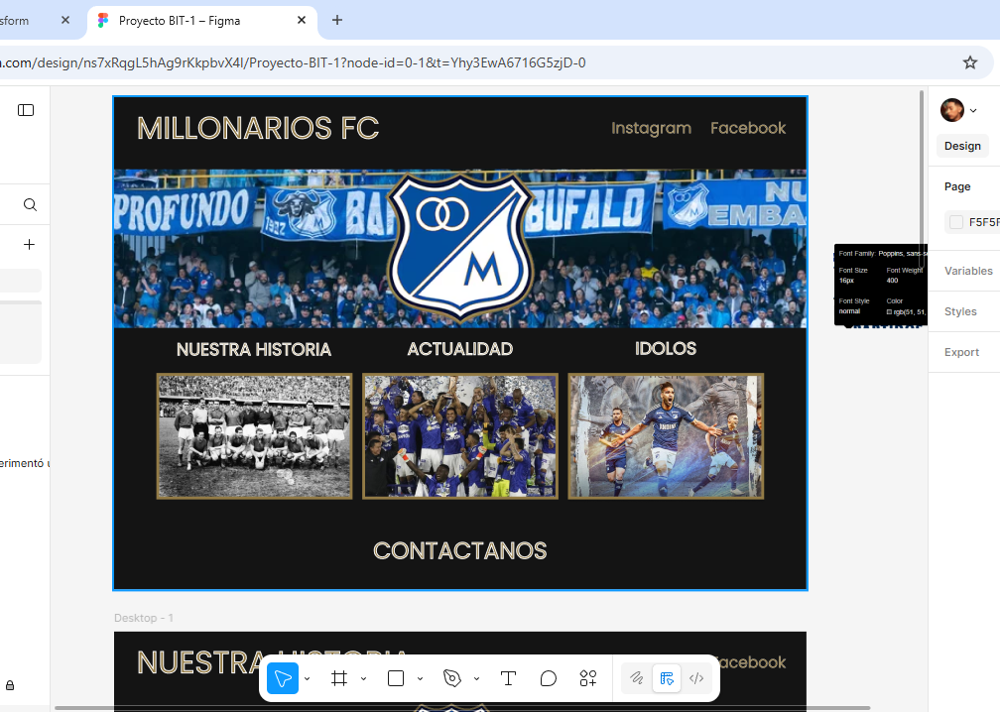

# BIT-1 PROYECTO MILLONARIOS FC webpage

## Bienvenidos a mi segundo proyecto calificable, en este proyecto, sigo implementando herramientas que he aprendido a usar en mi Bootcamp en BIT, 

## Lenguages como:
* - HTML 
* - CSS
* - JAVASCRIPT.

Y tambien implementando nuevas técnicas como herramientas framework y de diseño.

* - BOOTSTRAP
* - FIGMA

Adjunto cual era la intención principal de la pantalla de inicio:

Y el link del diseño completo en Figma para transcribir a codigo:

https://www.figma.com/design/ns7xRqgL5hAg9rKkpbvX4l/Proyecto-BIT-1?node-id=0-1&t=Yhy3EwA6716G5zjD-0

Ademas este proyecto será responsivo, con las siguientes medidas:

* Responsive
  - 576px
  - 768px
  - 992px
  - 992px+

Muchas gracias por verlo. 

---
# Autor: Joan Camilo Cruz Cortes.

## Para más proyectos: 
- Github: https://github.com/joancamilocruz
## Contáctame: 
- Linkedin: https://www.linkedin.com/in/joan-camilo-cruz-cortes-44b583249/?originalSubdomain=co

